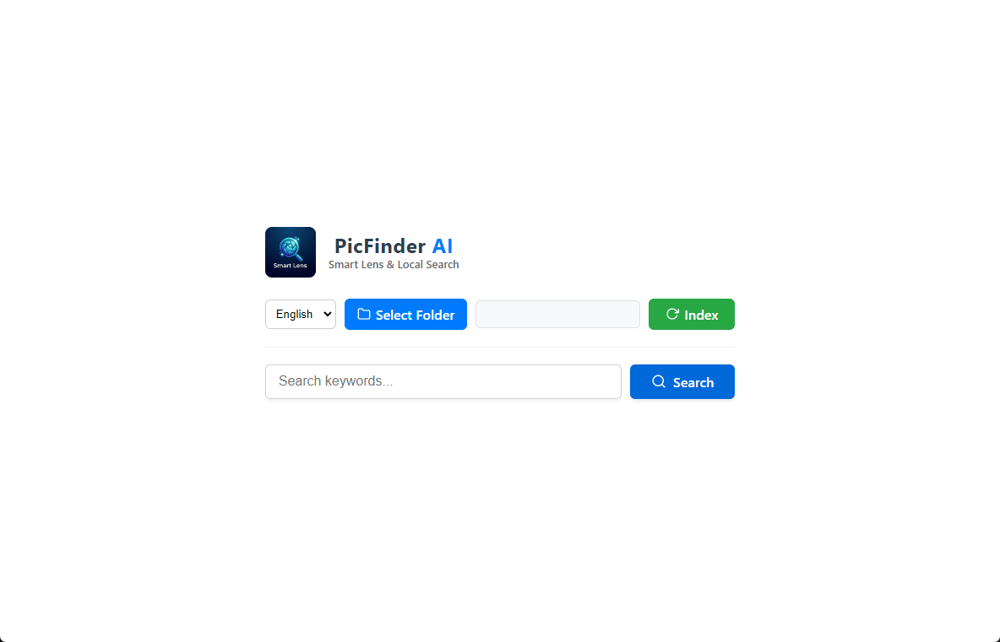

<div align="center">
  
  
  <h1>PicFinder AI 🔍</h1>
  
  <p>
    <strong>Smart Local Image Search Engine powered by OpenAI CLIP</strong>
  </p>
  
  <p>
    Semantic Search · 100% Privacy · Offline · Multilingual Support
  </p>

  <p>
    
    
    
    
  </p>
</div>

---

## 📖 Introduction

**PicFinder AI** is a desktop application that allows you to search through your local photo albums using natural language. Instead of remembering filenames, simply search for *"A cat sleeping on the sofa"* or *"Red sports car"*. 

Powered by the **CLIP** model and **ChromaDB**, it runs **100% offline**, ensuring your photos and data never leave your device.

<br>



## ✨ Features

- **Semantic Search**: Search by content description, not just keywords.
- **Privacy First**: Completely offline. No cloud uploads.
- **Smart Indexing**: Incremental scanning that only processes new images to save time.
- **Multilingual Support**: Supports queries in English, Chinese, and Japanese.
- **Cross-Platform**: Built with Electron & Python.

## 🚀 Quick Start

### 1. Clone the Repository

```bash
git clone [https://github.com/Breathinggg/PicFinder-AI.git](https://github.com/Breathinggg/PicFinder-AI.git)
cd PicFinder-AI
```

### 2. One-Click Installation

Run the installer script to automatically set up the Python virtual environment and install Node.js dependencies.

```bat
install.bat
```

### 3. Run the App

Start both the backend and frontend with a single command.

```bat
run_app.bat
```

> **⚠️ Important Note on First Run:**
>
> When you launch the app for the first time, the backend will automatically download the AI model (~1.5GB) from Hugging Face.  
> Please wait patiently and keep the terminal window open until the download completes. Once downloaded, the app will work offline forever.

## 🛠️ Tech Stack

- **Frontend**: Electron, Vue 3, Vite
- **Backend**: Python (FastAPI, Uvicorn)
- **AI Core**: sentence-transformers (clip-ViT-L-14)
- **Database**: ChromaDB (Vector Store)

## 🤝 Contributing

Contributions are welcome! Please feel free to submit a Pull Request.

## 📄 License

Distributed under the MIT License.

---

<div align="center">
  <p>Made with ❤️ by <a href="[https://github.com/Breathinggg](https://github.com/Breathinggg)">Breathinggg</a></p>
</div>